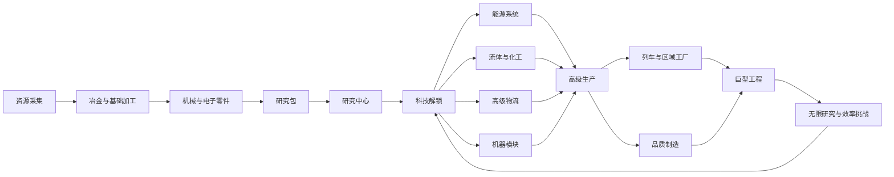
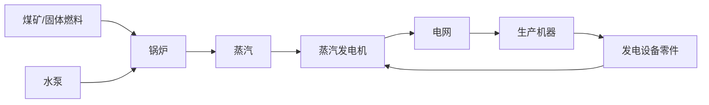
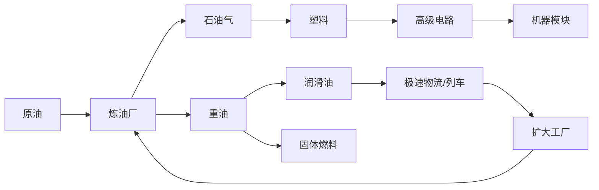

# FactoryGrid 综合扩展设计与实施路线

## 1. 文档定位

本文档将 FactoryGrid 当前已有的多层生产、研究中心、传送带、大型建造与 60 FPS 渲染体系，与后续建议中的能源、流体化工、机器模块、高级物流、信号网络、列车、品质、研究扩展和终局目标整合为一套可逐阶段实施的产品蓝图。

本文描述的是后续规划，不代表所有功能已经实现。

### 1.1 必须保持的项目原则

- 使用中文界面，机器本体不绘制文字。
- 机器和传送带直接、无缝连接，不依赖机械臂完成基础装卸。
- 机器与物品继续使用简洁几何图形，不依赖外部图片素材。
- 单个物品只使用一个基础几何体，不使用多个几何体拼接图标。
- 模拟逻辑使用固定 tick，显示动画使用 `requestAnimationFrame` 连续插值。
- 大型工厂以稳定 60 FPS 为目标，逐帧动画不进入 Vue 响应式状态。
- 双击机器打开配置面板，默认画布不显示永久文字、端口线或复杂覆盖层。
- 新系统必须兼容旧存档，并提供显式的存档版本迁移。

## 2. 当前系统基础

| 系统 | 当前能力 | 后续扩展入口 |
| --- | --- | --- |
| 物品 | T0-T6 层级、颜色与多边形图案 | 能源设备、化工材料、模块、列车部件、终局产品 |
| 配方 | 熔炉和合成器的数据驱动配方 | 多输出、副产物、流体输入、功耗和模块修正 |
| 物流 | 普通/高速传送带、分流、合流、地下通道、跨线运输 | 极速带、过滤、优先级、堆叠和长距离运输 |
| 研究 | 可放置研究中心、研究包、前置和解锁奖励 | 研究队列、科技分支、无限研究和新研究包 |
| 建造 | 框选复制、蓝图粘贴、批量拆除、区域升级 | 蓝图簿、参数化蓝图、幽灵规划、批量配置 |
| 模拟 | 固定 tick、缓存、物品转移和错误检测 | 电网、管网、信号网、铁路网和品质状态 |
| 渲染 | 静态工厂层与动态物品层分离 | 分块缓存、网络覆盖层、列车层和性能预算 |

## 3. 总体玩法闭环



核心循环分为五层：

1. **生产层**：资源被加工为不同层级的物品。
2. **物流层**：传送带、管道和列车把物品送到正确机器。
3. **基础设施层**：电网、模块和控制网络决定工厂运行效率。
4. **研究层**：研究包解锁配方、机器、物流能力和系统权限。
5. **目标层**：订单、里程碑和巨型工程持续消耗产品并推动扩建。

## 4. 统一物品视觉语言

### 4.1 层级图案

物品复杂度继续由 `tier` 驱动。图案表达层级，颜色表达材料类别。

| 层级 | 图案 | 定位 | 示例 |
| --- | --- | --- | --- |
| T0 | 圆形 | 天然资源 | 铁矿、铜矿、煤矿、石英 |
| T1 | 正三角形 | 初级精炼物 | 铁锭、铜锭、玻璃 |
| T2 | 正方形 | 基础工业件 | 铁板、钢材、齿轮、铜线 |
| T3 | 正五边形 | 复合零件 | 电路、塑料、钢制框架 |
| T4 | 正六边形 | 高级设备件 | 电机、处理器、泵体 |
| T5 | 正七边形 | 精密控制件 | 伺服机构、高级电路 |
| T6 | 正八边形 | 核心部件 | 自动化核心、效用研究包 |
| T7 | 正九边形 | 区域级设备 | 区域物流核心、产能模块 II |
| T8 | 正十边形 | 终局部件 | 巨型工程核心、工厂控制矩阵 |

T9 以上不继续增加普通物品图案边数，因为小尺寸下难以区分。无限研究使用项目等级数字，不增加新的物品层级。

### 4.2 材料颜色

| 类别 | 主色倾向 | 示例 |
| --- | --- | --- |
| 燃料与碳材料 | 黑色、深灰 | 煤矿、焦炭、固体燃料 |
| 铁钢与结构材料 | 灰白、银色 | 铁矿、铁锭、钢材、框架 |
| 铜与导电材料 | 棕色、铜色 | 铜矿、铜锭、铜线 |
| 电路与控制 | 绿色 | 电路、信号控制器 |
| 流体与物流设备 | 蓝色 | 泵体、物流研究包 |
| 高级计算与核心 | 紫色 | 处理器、自动化核心 |
| 热能与高功率设备 | 红色 | 锅炉部件、涡轮组件 |

品质只通过同一图形的亮度、描边精度和轻微发光强度区分，不添加星标、角标或第二个几何体。

## 5. 扩展生产体系

### 5.1 现有主链

```text
铁矿 + 煤矿 -> 铁锭 -> 铁板 -> 齿轮 ┐
                                      ├-> 电机 -> 伺服机构 ┐
铜矿 + 煤矿 -> 铜锭 -> 铜线 -> 电路 ┘                     ├-> 自动化核心
铁锭 + 煤矿 -> 钢材 -> 轴承/钢制框架 ---------------------┘
```

### 5.2 能源设备链

| 产物 | 层级 | 配方 | 用途 |
| --- | --- | --- | --- |
| 锅炉壳体 | T3 | 钢材 x2 + 铁板 x2 | 建造锅炉 |
| 发电机线圈 | T3 | 铜线 x3 + 铁板 | 建造蒸汽发电机 |
| 蒸汽涡轮 | T4 | 钢材 x2 + 轴承 + 发电机线圈 | 中期高效发电 |
| 蓄电单元 | T4 | 电路 + 铜线 x2 + 钢材 | 建造蓄电站 |
| 太阳能单元 | T4 | 玻璃 x2 + 电路 + 铜线 | 建造太阳能板 |
| 电网控制器 | T5 | 处理器 + 电路 + 蓄电单元 | 电网统计与优先级 |

### 5.3 流体与化工链

| 产物 | 层级/类型 | 配方或过程 | 下游 |
| --- | --- | --- | --- |
| 水 | 流体 | 水泵持续抽取 | 锅炉、化工厂 |
| 原油 | 流体 | 油井持续抽取 | 炼油厂 |
| 石油气 | 流体 | 原油精炼 | 塑料、固体燃料 |
| 重油 | 流体 | 原油精炼副产物 | 润滑油、固体燃料 |
| 润滑油 | 流体 | 重油处理 | 极速传送带、列车部件 |
| 玻璃 | T1 | 石英 + 煤矿 -> 熔炉 | 太阳能、光学部件 |
| 固体燃料 | T2 | 重油裂解或石油气合成 | 锅炉、列车燃料 |
| 塑料 | T3 | 石油气 + 煤矿 | 高级电路、化工研究 |
| 高级电路 | T5 | 电路 x2 + 塑料 x2 + 铜线 x2 | 模块、列车控制、终局产品 |

炼油配方必须支持多输出。石油气出口畅通但重油出口堵塞时，炼油厂整体停止，迫使玩家处理副产物，不能静默删除副产物。

### 5.4 模块链

| 模块 | 层级 | 配方 | 正向效果 | 代价 |
| --- | --- | --- | --- | --- |
| 速度模块 I | T5 | 电机 + 处理器 + 高级电路 | 速度 +20% | 功耗 +30% |
| 节能模块 I | T5 | 电路 x2 + 蓄电单元 | 功耗 -25% | 速度 -5% |
| 产能模块 I | T6 | 自动化核心 + 高级电路 + 钢制框架 | 额外产出 +8% | 速度 -15%、功耗 +40% |
| 速度模块 II | T7 | 速度模块 I x2 + 伺服机构 | 速度 +35% | 功耗 +55% |
| 产能模块 II | T7 | 产能模块 I x2 + 控制单元 | 额外产出 +15% | 速度 -25%、功耗 +70% |

模块是机器配置，不在画布上单独占格。双击生产机器后，在配方面板内安装或移除模块。

### 5.5 控制、研究与终局中间件

| 产物 | 层级 | 配方 | 解锁来源 | 下游 |
| --- | --- | --- | --- | --- |
| 泵体 | T4 | 钢材 + 电机 + 塑料 | 石油化工 | 泵、炼油设备 |
| 控制单元 | T6 | 处理器 x2 + 伺服机构 + 高级电路 | 工厂控制 | 产能模块 II、列车控制 |
| 精密处理器 | T6 | 处理器 x2 + 高级电路 + 精密品质电路 | 精密制造 | 区域研究包、巨型工程 |
| 区域研究包 | T7 | 信号控制器 + 精密处理器 + 产能模块 II | 精密制造 + 自动调度 | 区域工业研究 |
| 工厂控制矩阵 | T8 | 区域物流核心 + 精密处理器 x2 + 自动化核心 | 区域工业 | 巨型工程控制阶段 |

“精密品质电路”不是新物品种类，而是品质至少为“精密”的高级电路。区域研究包所需材料在其前置项目完成后均可生产，因此不会产生研究循环。

### 5.6 列车与终局链

| 产物 | 层级 | 配方 | 用途 |
| --- | --- | --- | --- |
| 强化轨材 | T5 | 钢材 x3 + 铁板 x2 | 铺设铁路 |
| 机车驱动组 | T6 | 电机 x2 + 伺服机构 + 钢制框架 | 建造机车 |
| 信号控制器 | T6 | 处理器 x2 + 高级电路 + 电路 | 区块与车站控制 |
| 区域物流核心 | T7 | 信号控制器 + 自动化核心 + 电网控制器 | 高级列车调度 |
| 巨型工程框架 | T7 | 钢制框架 x4 + 伺服机构 x2 + 高级电路 | 终局工程阶段一 |
| 巨型工程核心 | T8 | 区域物流核心 + 自动化核心 x2 + 产能模块 II | 终局工程阶段二 |

## 6. 能源系统

### 6.1 设计目标

能源必须形成新的布局和生产闭环：玩家制造发电设备，输送水与燃料，建立电网，再用稳定电力驱动高级工业链。

### 6.2 核心机器

| 机器 | 输入 | 输出 | 行为 |
| --- | --- | --- | --- |
| 水泵 | 水源格 | 水 | 持续向管道注水 |
| 锅炉 | 水 + 煤矿/固体燃料 | 蒸汽 | 燃料决定持续时间和效率 |
| 蒸汽发电机 | 蒸汽 | 电力 | 按蒸汽流量发电 |
| 太阳能板 | 日照 | 电力 | 输出随昼夜变化 |
| 蓄电站 | 富余电力 | 储能/放电 | 电力不足时自动补充 |
| 变电站 | 电力连接 | 供电范围 | 连接附近机器并统计电网 |

### 6.3 电网规则

- 每个电网独立统计供给功率、需求功率、储能和供电比例。
- 供电比例不低于 100% 时，机器按正常速率运行。
- 供电比例在 20%-100% 时，机器按比例降速，不直接停机。
- 供电比例低于 20% 时，生产机器进入“电力不足”状态。
- 物流设备保留最低运行速度，防止整个工厂进入不可恢复的锁死状态。
- 发电、蓄电和关键泵可设置“关键、生产、一般”三级供电优先级。
- 新存档完成“基础电气化”研究后才启用电力约束。
- 旧存档迁移时提供临时供电核心，避免载入后全厂立即停摆。

### 6.4 能源闭环



## 7. 流体与化工系统

### 7.1 管道交互

- 管道按网格铺设，支持直线、转弯和自动连接。
- 管道不显示永久箭头；选中管网或使用流体工具时才显示淡色流向。
- 不同流体不能进入同一连通管网，冲突预览直接判定为无效。
- 地下管道成对连接，用于跨越传送带和机器入口。
- 泵负责强制单向流动、隔离网络和提升长距离吞吐。
- 储液罐提供大容量缓冲，仅用液位表现状态，不在机器上绘制文字。

### 7.2 流体模拟

初版采用确定性的网络配额模型，不模拟真实压力波：

1. 只重建发生拓扑变化的管网。
2. 生产者登记本 tick 可输出量。
3. 消费者按优先级登记请求量。
4. 网络按可用量分配流体并更新储液罐。
5. 泵把一个网络拆分为两个有方向的网络。

该模型可以表现缺液、堵塞和多消费者竞争，同时适合浏览器大型工厂。

### 7.3 化工闭环



## 8. 机器升级与模块

### 8.1 机器等级

| 等级 | 解锁阶段 | 模块槽 | 基础速度 | 基础功耗 |
| --- | --- | --- | --- | --- |
| 1 级 | 初始 | 0 | 100% | 100% |
| 2 级 | 自动化升级 | 1 | 125% | 140% |
| 3 级 | 规模化生产 | 2 | 160% | 210% |
| 4 级 | 精密制造 | 3 | 200% | 300% |

升级规划器负责区域升级。升级前检查研究权限与材料成本，升级后保留方向、配方、输入缓存和模块配置。

### 8.2 结算顺序

```text
最终速度 = 基础速度 x 等级倍率 x (1 + 模块速度修正) x 供电比例
最终功耗 = 基础功耗 x 等级功耗倍率 x (1 + 模块功耗修正)
最终产出 = 配方基础产出 + 产能进度累计奖励
```

产能模块不使用随机额外掉落。产能加成 8% 时，每次生产增加 0.08 产能进度，累计到 1 时稳定增加一个产物，使结果可预测、可测试。

## 9. 高级物流

### 9.1 传送带等级

| 等级 | 名称 | 内部模型 | 解锁 | 关键材料 |
| --- | --- | --- | --- | --- |
| L1 | 普通传送带 | 2 tick/格，单槽 | 初始 | 铁板、齿轮 |
| L2 | 高速传送带 | 1 tick/格，单槽 | 物流工程 | 电机、电路 |
| L3 | 极速传送带 | 1 tick/格，双槽交错 | 高级物流 | 润滑油、伺服机构 |

L3 不提高全局 tick 频率。每格使用两个相位槽，渲染时按相位插值，使吞吐提高而不会让整个模拟翻倍运行。

### 9.2 新物流组件

| 组件 | 功能 | 交互 |
| --- | --- | --- |
| 过滤分流器 | 指定物品走固定支路 | 双击选择过滤物品 |
| 优先分流器 | 优先主支路，堵塞后走备用 | 双击选择优先方向 |
| 优先合流器 | 优先接收指定输入 | 双击选择优先输入 |
| 堆叠器 | 同类物品组成运输批次 | 不改变物品图案 |
| 解堆器 | 批次恢复为单件 | 与堆叠器形成闭环 |
| 物流监测器 | 统计吞吐和堵塞率 | 仅选中时显示数据 |

### 9.3 传送带内部逻辑

- 方向只由传送带实体自身决定，不能由相邻箭头反推。
- 转弯外观由“当前方向 + 有效上游方向”生成，移动路径使用预计算路径段。
- 分流器使用稳定轮询游标；备用出口成功时同样只推进一次游标。
- 合流器使用公平输入队列，防止某一方向长期饥饿。
- 机器输出在下一格确认接收后才移出缓存，避免物品消失后重新出现。
- 动画位置由 `enteredTick`、移动间隔与 `renderAlpha` 计算。
- 预览和实际放置共用路线解析函数，保证方向与转弯完全一致。

## 10. 信号与控制网络

### 10.1 设计目标

信号网络为高级玩家提供条件控制，但默认不污染画面。只有切换到“信号视图”或选中逻辑设备时，才显示连接和数值。

### 10.2 基础组件

| 组件 | 输入 | 输出 | 示例 |
| --- | --- | --- | --- |
| 传送带读取器 | 当前物品或吞吐 | 计数信号 | 铁板每分钟流量 |
| 缓存读取器 | 机器输入/输出缓存 | 库存信号 | 煤矿剩余量 |
| 比较器 | 两个信号或信号与常量 | 0/1 条件 | 铁板 > 100 |
| 算术器 | 两个数值 | 运算结果 | 需求 - 库存 |
| 信号开关 | 条件信号 | 启用/停用 | 控制传送带、泵或机器 |
| 显示器 | 任意信号 | 画布覆盖层 | 显示局部产量 |

### 10.3 执行顺序

每个模拟 tick 固定执行：

1. 采集传感器值。
2. 计算逻辑节点。
3. 提交设备启停与优先级。
4. 执行生产、电力、流体和物流。
5. 记录统计与错误。

逻辑节点只读取上一 tick 的稳定输出，循环网络自然产生一 tick 延迟，不在单 tick 内无限求解。

## 11. 列车与区域物流

### 11.1 定位

列车解决跨区域大宗运输，不替代工厂内部传送带。它应在地图扩展到多个资源区后解锁。

### 11.2 实体

- 直轨、弯轨和交叉轨。
- 机车和货运车厢。
- 装货站、卸货站和双向车站。
- 区块信号与链式信号。
- 列车调度中心。

### 11.3 调度规则

- 铁路由信号划分区块，一个普通区块同一时间只允许一列车占用。
- 列车发车前预留到下一个停车点的路径。
- 车站通过名称、货物条件和等待条件组成时刻表。
- 车站与相邻传送带或管道直接交换物品，不引入机械臂。
- 调度中心可设置列车上限、站点优先级和最低装载量。
- 轨道与列车使用独立渲染层，列车按路径参数插值，不做像素碰撞。

### 11.4 区域闭环


## 12. 研究系统扩展

### 12.1 研究中心交互

- 研究中心仍然是画布机器，不恢复固定研究侧栏。
- 双击研究中心打开科技树，单击项目查看需求、效果、前置和预计耗时。
- 支持最多 5 个项目的研究队列。
- 多个研究中心可并行贡献同一项目。
- 所有研究中心只消耗当前队首项目需要的研究包。
- 切换项目不清除已消耗数量，也不删除机器缓存中的研究包。

### 12.2 扩展研究树

| 分支 | 项目 | 前置 | 研究包 | 解锁 |
| --- | --- | --- | --- | --- |
| 现有 | 物流工程 | 无 | 物流 x10 | 高速传送带 |
| 现有 | 自动化升级 | 物流工程 | 自动化 x12 | 2 级机器、升级规划器 |
| 现有 | 冶金自动化 | 自动化升级 | 冶金 x12 | 轴承、钢制框架 |
| 现有 | 高级电子学 | 自动化升级 | 电子 x14 | 处理器、高级电子入口 |
| 现有 | 机器人技术 | 冶金 + 电子 | 机器人 x16 | 伺服机构 |
| 现有 | 自动化核心 | 机器人技术 | 核心 x18 | 自动化核心 |
| 现有 | 规模化生产 | 自动化核心 | 效用 x20 | 3 级机器 |
| 能源 E1 | 基础电气化 | 物流工程 | 物流 x12 + 自动化 x8 | 锅炉、发电机、变电站 |
| 能源 E2 | 能量储存 | 基础电气化 | 自动化 x16 + 电子 x10 | 蓄电站、电网优先级 |
| 能源 E3 | 可再生能源 | 能量储存 | 电子 x20 + 效用 x12 | 太阳能、智能充放电 |
| 化工 C1 | 流体工程 | 基础电气化 | 物流 x14 + 冶金 x10 | 管道、水泵、储液罐 |
| 化工 C2 | 石油化工 | 流体工程 | 冶金 x16 + 电子 x12 | 油井、炼油厂、塑料 |
| 化工 C3 | 高级化工 | 石油化工 | 电子 x18 + 核心 x12 | 润滑油、燃料、高级电路 |
| 物流 L1 | 高级物流 | 流体工程 + 规模化生产 | 物流 x20 + 效用 x12 | 极速带、优先组件 |
| 物流 L2 | 物流堆叠 | 高级物流 | 自动化 x20 + 效用 x16 | 堆叠器、解堆器 |
| 模块 M1 | 模块化生产 | 高级电子学 + 能量储存 | 电子 x18 + 核心 x10 | 速度/节能模块 I |
| 模块 M2 | 产能优化 | 模块化生产 + 高级化工 | 核心 x18 + 效用 x14 | 产能模块与 II 级模块 |
| 控制 S1 | 信号网络 | 高级电子学 | 电子 x16 | 读取器、比较器、开关 |
| 控制 S2 | 工厂控制 | 信号网络 + 高级物流 | 核心 x16 | 算术器、条件控制 |
| 铁路 T1 | 铁路运输 | 高级物流 + 高级化工 | 冶金 x20 + 核心 x14 | 铁轨、车站、机车 |
| 铁路 T2 | 自动调度 | 铁路运输 + 工厂控制 | 核心 x20 + 效用 x16 | 信号、调度中心 |
| 终局 Q1 | 精密制造 | 产能优化 | 核心 x24 + 效用 x20 | 4 级机器、品质系统 |
| 终局 Q2 | 区域工业 | 自动调度 + 精密制造 | 区域研究包 x24 | 区域物流核心、巨型工程 |

### 12.3 无限研究

完成巨型工程后开放可重复研究：

- 传送带吞吐：每级 +3%，最多 20 级。
- 机器速度：每级 +2%，最多 25 级。
- 发电效率：每级 +3%，最多 20 级。
- 列车容量：每级 +5%，最多 10 级。
- 产能研究：每级 +1%，最多 15 级。

第 `n` 级成本使用：

```text
cost(n) = baseCost x 1.35^(n - 1)
```

无限研究只增加数值，不继续解锁新界面和新机器。

## 13. 品质系统

### 13.1 品质等级

| 品质 | 产出定位 | 机器效果 |
| --- | --- | --- |
| 标准 | 默认产物 | 无修正 |
| 优良 | 低概率高品质 | 速度或功率属性 +5% |
| 精密 | 很低概率 | 速度或功率属性 +10% |
| 卓越 | 终局品质 | 速度或功率属性 +18% |

### 13.2 规则

- “精密制造”研究完成后才启用品质，避免早期物品种类爆炸。
- 未安装品质模块时只生产标准品质物品。
- 配方可设置最低输入品质，不能混用低于要求的材料。
- 产物品质由最低输入品质和品质模块共同决定。
- 同一物品的不同品质不能在普通机器缓存中自动合并。
- 传送带仍按物品类型运输，不为品质增加额外寻路逻辑。
- 品质视觉保持单一几何体，仅调整描边和亮度。

品质闭环是“牺牲部分吞吐和材料，换取更高性能设备”，而不是随机收藏系统。

## 14. 目标、订单与终局

### 14.1 三类目标

| 类型 | 作用 | 示例 |
| --- | --- | --- |
| 里程碑 | 引导新系统 | 稳定供电 5 分钟、完成首批塑料 |
| 订单 | 持续消耗产品 | 每分钟交付 60 电机并持续 3 分钟 |
| 挑战 | 提供重复玩法 | 限电、限地块或限机器完成目标 |

### 14.2 巨型工程

终局使用多阶段持续交付：

1. **区域骨架**：钢制框架、强化轨材和电机。
2. **能源核心**：电网控制器、蓄电单元和高级电路。
3. **控制矩阵**：自动化核心、信号控制器、精密处理器和工厂控制矩阵。
4. **稳定运行**：规定时间内维持目标吞吐、供电率和列车准点率。

完成后开放无限研究、统计结算和自由模式，不结束当前工厂。

### 14.3 评分维度

- 平均每分钟有效交付量。
- 电网供电稳定率。
- 机器平均利用率。
- 传送带堵塞时间占比。
- 单位产品能耗。
- 列车平均等待时间。
- 工厂占地与机器数量。

评分用于复盘和挑战，不限制沙盒模式的自由建造。

## 15. 大型工厂建造工具

### 15.1 蓝图簿

- 支持分组、命名、搜索和排序。
- 保存实体方向、机器等级、配方、模块和逻辑配置。
- 不保存当前缓存物品、研究进度、电量和流体余量。
- 导入时执行版本迁移和实体类型校验。

### 15.2 参数化蓝图

粘贴时允许替换预先声明的参数：

- 输入物品与目标配方。
- 传送带等级。
- 机器等级。
- 过滤分流器的过滤物品。
- 车站名称与装卸条件。

参数化蓝图不执行任意脚本。

### 15.3 幽灵规划

- 材料不足时可以放置半透明规划实体。
- 幽灵不参与模拟、碰撞和网络拓扑。
- 批量确认时一次性校验位置与解锁条件。
- 一次区域操作对应一个撤销历史步骤。

### 15.4 区域诊断

框选区域后显示：

- 输入、输出与净消耗。
- 理论吞吐与实际吞吐。
- 最长堵塞机器。
- 能源需求与供电比例。
- 管道缺液率。
- 可升级实体数量和材料需求。

## 16. 技术架构扩展

### 16.1 数据模型

建议将单输出配方兼容扩展为多资源结构：

```ts
type ResourceCategory = 'solid' | 'fluid'
type Quality = 'standard' | 'improved' | 'precision' | 'excellent'

interface ResourceDefinition {
  id: string
  name: string
  category: ResourceCategory
  tier: number
  color: string
}

interface ResourceAmount {
  resourceId: string
  amount: number
  quality?: Quality
}

interface RecipeDefinition {
  id: string
  machine: string
  durationTicks: number
  solidInputs: ResourceAmount[]
  fluidInputs: ResourceAmount[]
  outputs: ResourceAmount[]
  fluidOutputs: ResourceAmount[]
  powerDemand: number
  requiredResearch?: string
}
```

当前 `ShapeId` 在兼容期继续存在，但新系统应逐步让 `resourceId` 成为模拟层主键，避免每新增物品都修改大型联合类型。

### 16.2 网络运行时

```ts
interface PowerNetworkState {
  id: string
  entityIds: string[]
  supply: number
  demand: number
  stored: number
  capacity: number
}

interface FluidNetworkState {
  id: string
  fluidId?: string
  segmentIds: string[]
  amount: number
  capacity: number
}

interface SignalNetworkState {
  id: string
  nodeIds: string[]
  current: Record<string, number>
  next: Record<string, number>
}
```

网络拓扑只在放置、旋转、删除或升级相关实体时标记为脏，并在下一个模拟 tick 重建。普通物品移动不能触发网络重建。

### 16.3 模块边界

```text
src/
  data/
    resources.ts
    recipes.ts
    research.ts
    powerMachines.ts
    fluidMachines.ts
    modules.ts
    objectives.ts
  engine/simulation/
    tickEngine.ts
    productionSystem.ts
    beltSystem.ts
    powerSystem.ts
    fluidSystem.ts
    signalSystem.ts
    trainSystem.ts
    qualitySystem.ts
  engine/networks/
    networkGraph.ts
    powerNetwork.ts
    fluidNetwork.ts
    signalNetwork.ts
    railBlocks.ts
  render/
    canvasRenderer.ts
    itemRenderer.ts
    networkOverlayRenderer.ts
    trainRenderer.ts
  components/dialogs/
    RecipeDialog.vue
    ResearchDialog.vue
    ModuleDialog.vue
    SignalDialog.vue
    StationDialog.vue
```

`tickEngine.ts` 只负责确定子系统执行顺序，各子系统独立处理自己的状态。

### 16.4 存档版本

```ts
interface SavedProject {
  schemaVersion: number
  project: FactoryProject
}
```

迁移顺序建议：

```text
v1 当前存档
 -> v2 多输出配方和资源主键
 -> v3 电网与流体网络
 -> v4 模块、品质和列车
```

迁移失败时保留原始存档副本，并提供中文错误提示和导出入口。

## 17. 60 FPS 性能方案

### 17.1 每帧预算

60 Hz 屏幕每帧预算约 16.67ms：

| 工作 | 目标预算 |
| --- | --- |
| 输入与相机 | 1.0ms |
| 静态层重绘 | 平均 2.0ms，仅脏区发生 |
| 动态物品与列车 | 5.0ms |
| Vue UI 更新 | 2.0ms |
| 浏览器合成与波动预留 | 6.67ms |

模拟 tick 不要求每帧执行，必须继续与渲染解耦。

### 17.2 必须保持的策略

- 静态机器/传送带与动态物品分层 Canvas。
- 只绘制视口和一格缓冲区内实体。
- 同图案物品批量绘制，减少路径与状态切换。
- 动画使用模拟前后状态插值，不修改 Vue 响应式坐标。
- 页面失焦恢复时限制补算 tick 数量。
- 运行模拟时不周期性序列化完整工程。
- 性能面板低频采样，不能每帧触发整个应用更新。

### 17.3 新系统优化

| 系统 | 性能措施 |
| --- | --- |
| 电网 | 拓扑脏标记，数值每 tick 聚合一次 |
| 管网 | 连通网络配额模型，不逐管段求压力 |
| 信号 | 双缓冲信号表，每 tick 只计算一次 |
| 列车 | 路径参数插值，区块级碰撞 |
| 品质 | 使用小整数枚举，不复制物品定义 |
| 蓝图 | 批量校验和提交，单次历史快照 |
| 渲染 | 地图分块缓存，只重建脏分块 |

### 17.4 自动降级

平均 FPS 连续 3 秒低于 55 时：

1. 降低动态 Canvas 的设备像素比上限。
2. 减少传送带装饰帧，不降低物品插值精度。
3. 降低网络覆盖层刷新频率。
4. 停止视口外统计采样。

平均 FPS 连续 5 秒高于 59 时逐级恢复。降级不能改变模拟结果和吞吐。

## 18. 状态提示与诊断

机器本体不显示文字，状态通过选中面板与轻量轮廓表达。

| 状态 | 画布反馈 | 面板说明 |
| --- | --- | --- |
| 缺少输入 | 低亮度呼吸轮廓 | 缺少的物品或流体 |
| 输出堵塞 | 暖色轮廓 | 堵塞出口和持续时间 |
| 电力不足 | 间歇低亮 | 当前供电比例 |
| 配方未选择 | 中性虚线轮廓 | 双击选择配方 |
| 管网冲突 | 放置预览红色 | 流体类型冲突 |
| 信号停机 | 冷色轮廓 | 触发条件表达式 |

底部状态栏继续显示 FPS、帧耗时、速度、交付和堵塞概况。能源、流体和列车信息通过独立视图切换，不恢复永久右侧边栏。

## 19. 分阶段实施路线

### 阶段 A：模型与性能基线

**目标**：建立可迁移的数据结构，不改变当前玩法。

- 将配方从单一 `output` 兼容扩展为 `outputs[]`。
- 引入 `schemaVersion` 和存档迁移器。
- 将传送带、生产和研究逻辑拆分为子系统。
- 建立 1000、3000、5000 条传送带性能场景。

**验收**：

- 当前单元、集成和 E2E 测试全部通过。
- 旧存档可正常载入。
- 816 条可见传送带场景保持接近 60 FPS。

### 阶段 B：能源系统

**目标**：形成“燃料 + 水 -> 蒸汽 -> 电力 -> 生产”闭环。

- 水泵、锅炉、蒸汽发电机、变电站和蓄电站。
- 电网连通、供需、降速和优先级。
- 基础电气化与能量储存研究。
- 能源视图和电力不足诊断。

**验收**：断煤、断水、过载与恢复供电均产生确定结果；旧工厂不会因迁移立即停摆。

### 阶段 C：流体与化工

**目标**：形成“原油 -> 塑料/润滑油/燃料 -> 高级产品”闭环。

- 管道、地下管道、泵和储液罐。
- 油井、炼油厂与化工厂。
- 多输出配方和副产物堵塞。
- 流体、石油和高级化工研究。

**验收**：流体不能混管；副产物堵塞会停止生产；管网不造成明显帧率下降。

### 阶段 D：高级物流与模块

**目标**：扩大吞吐，并允许玩家选择速度、能耗或产能方向。

- 极速传送带双槽模型。
- 过滤、优先分流和优先合流。
- 速度、节能、产能模块与模块槽。
- 区域升级保留配置。

**验收**：预览与实际方向一致；分流公平；产能结果可预测；升级不丢失配方和缓存。

### 阶段 E：信号与大型建造

**目标**：提供条件控制和可复用的大型工厂模板。

- 读取器、比较器、算术器、开关和显示器。
- 信号覆盖视图。
- 蓝图簿、参数化蓝图和幽灵规划。
- 区域吞吐与瓶颈诊断。

**验收**：循环信号产生稳定的一 tick 延迟；默认视图不显示杂乱线路；蓝图导入不执行脚本。

### 阶段 F：列车与区域工厂

**目标**：支持远距离资源区与主工厂之间的大宗物流。

- 铁路、机车、车厢、车站和信号。
- 时刻表、装载条件与自动调度。
- 远端资源区与地图分块加载。

**验收**：列车不进入已占用区块；车站可直接交换物品；远处列车不持续占用完整渲染成本。

### 阶段 G：品质与终局

**目标**：建立可长期优化的终局生产和挑战体系。

- 品质模块与四级品质。
- 巨型工程四阶段交付。
- 无限研究、订单和效率评分。
- 完整统计复盘。

**验收**：未解锁品质时不增加早期复杂度；终局完成后工厂继续运行；无限研究成本正确递增。

## 20. 功能闭环总表

| 模块 | 输入 | 核心处理 | 输出 | 反向收益 |
| --- | --- | --- | --- | --- |
| 基础生产 | 矿物、煤矿 | 熔炼、组装 | T1-T6 产品 | 研究包与设备材料 |
| 能源 | 水、燃料、设备 | 发电、储能、配电 | 可用功率 | 提高机器持续运行能力 |
| 化工 | 原油、水、煤矿 | 精炼、裂解、合成 | 塑料、润滑油、燃料 | 模块、极速带和列车 |
| 高级物流 | 机器输出、物流设备 | 过滤、优先、堆叠 | 高吞吐物料流 | 支撑更大规模生产 |
| 机器模块 | 高级电子和核心部件 | 速度/节能/产能修正 | 定制机器能力 | 降低单位成本或占地 |
| 信号控制 | 库存、吞吐、电力数据 | 比较与运算 | 控制信号 | 减少过量生产和堵塞 |
| 研究 | 多类研究包 | 队列和前置检查 | 配方、机器、等级 | 打开下一阶段生产链 |
| 列车 | 远端资源、铁路设备 | 区块调度、装卸 | 大宗长距离物流 | 连接区域工厂 |
| 品质 | 高品质材料、品质模块 | 品质继承和提升 | 高性能部件 | 提升终局效率 |
| 目标 | 产品和稳定运行数据 | 订单与巨型工程 | 解锁、评分、无限研究 | 持续驱动扩建 |

## 21. 测试与验收矩阵

### 21.1 单元测试

- 配方多输入、多输出和副产物守恒。
- 电网供需、储能与优先级。
- 管网流体冲突和消费者配额。
- 模块速度、功耗与产能累计公式。
- 分流轮询、合流公平和双槽传送带。
- 信号双缓冲与循环延迟。
- 列车区块预留和路径释放。
- 品质继承、最低品质与概率边界。
- 研究前置、队列和无限成本公式。
- 各版本存档迁移。

### 21.2 集成测试

- 煤矿和水能持续驱动生产线。
- 原油同时产出石油气和重油，任一副产物堵塞都会停止炼油。
- 化工产品能制造模块，模块真实影响吞吐和功耗。
- 信号读取库存后可以控制泵或传送带。
- 列车能从远端矿区装货并在主工厂卸货。
- 研究中心可以完整解锁能源、化工或铁路分支。
- 巨型工程配方不存在循环依赖。

### 21.3 E2E 测试

- 放置、旋转和连接新机器。
- 双击打开研究、配方、模块与车站面板。
- 管道和传送带预览与实际放置一致。
- 蓝图保留配方、方向、模块与信号设置。
- 批量拆除与撤销恢复完整网络。
- 大型场景中画布移动和动画保持连续。

### 21.4 性能验收

- 816 条可见传送带场景平均达到 59 FPS 以上。
- 3000 条总传送带、1000 个动态物品时，P95 帧时间不超过 20ms。
- 电网、管网和信号网未变化时不进行全图拓扑重建。
- 页面切回前台后不连续补算大量 tick。
- 性能降级只影响视觉细节，不改变模拟结果。

## 22. 推荐开发优先级

1. **阶段 A：模型与性能基线**，先消除后续系统的结构风险。
2. **能源系统**，与现有煤矿、机器等级和研究体系形成首个新闭环。
3. **流体与化工**，为塑料、润滑油、高级电路提供材料基础。
4. **高级物流与机器模块**，解决扩大工厂后的吞吐与定制问题。
5. **信号网络与蓝图增强**，提高自动化自由度和维护效率。
6. **列车与区域工厂**，在地图和产线规模足够后引入。
7. **品质、巨型工程与无限研究**，作为成熟系统的终局内容。

能源和化工是高层系统的共同基础，不建议先制作列车或品质，再回头补能源与流体。每个阶段都应同时完成数据、模拟、画布交互、中文界面、存档迁移、测试和性能基准，避免形成只能放置但不能运行的机器。
